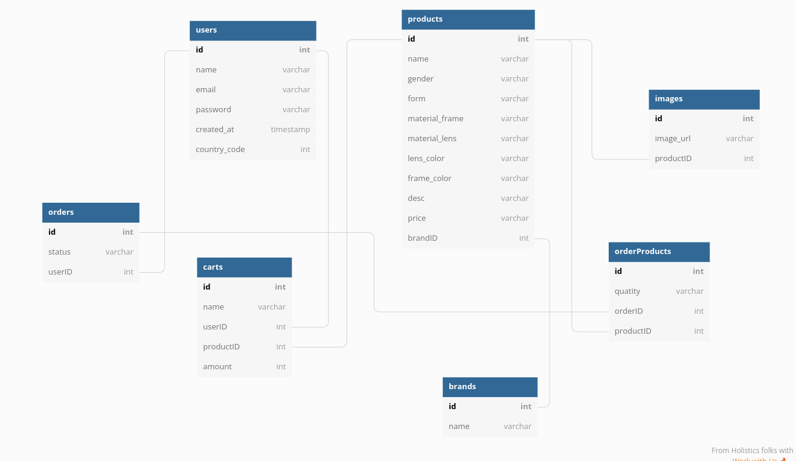
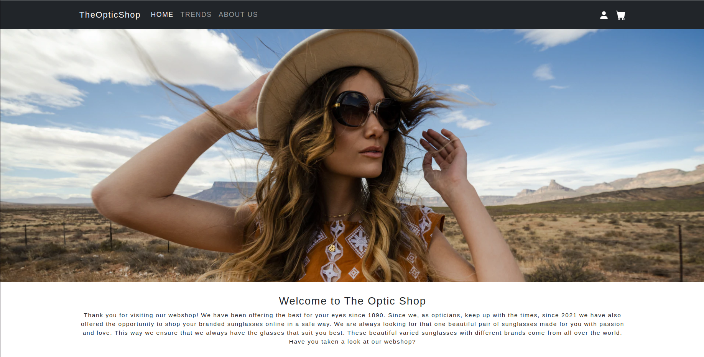
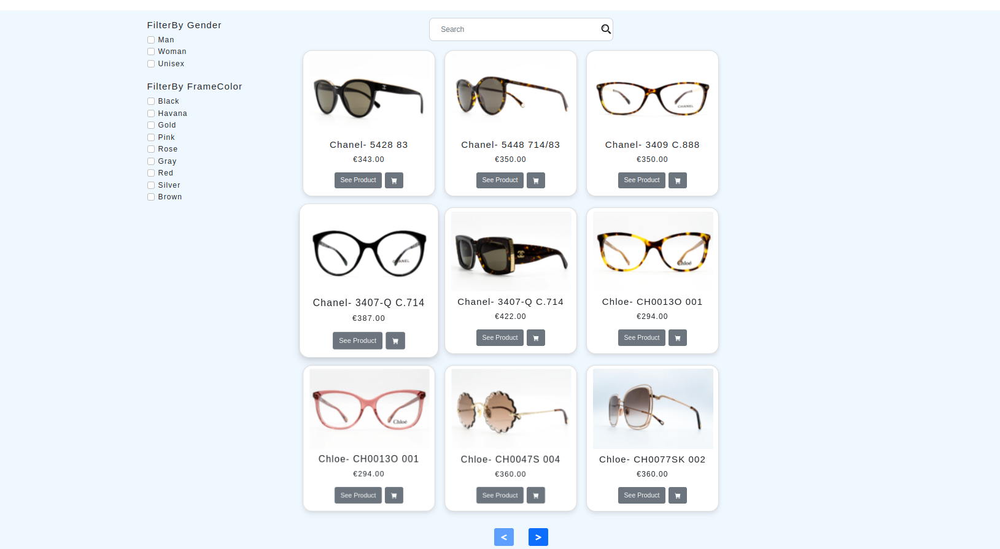
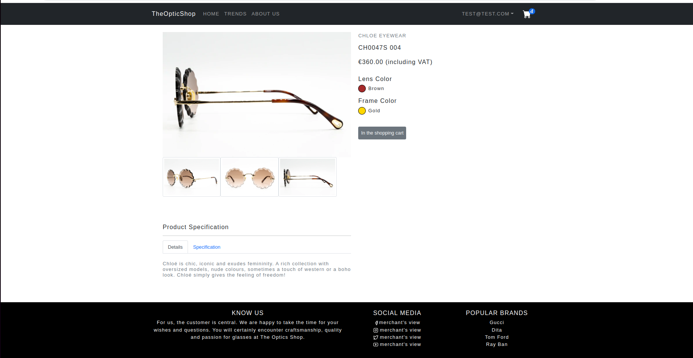
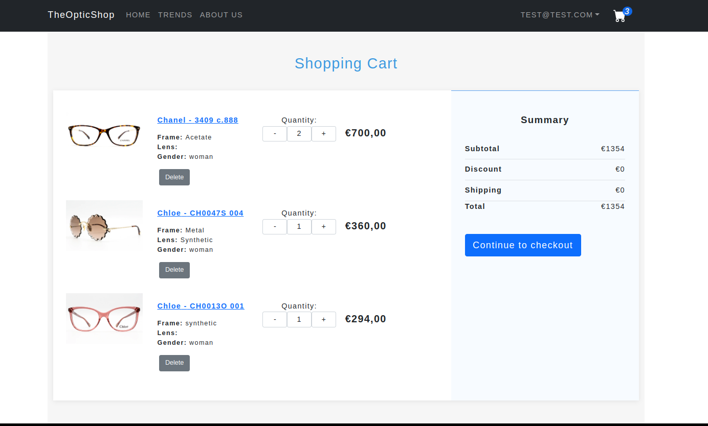
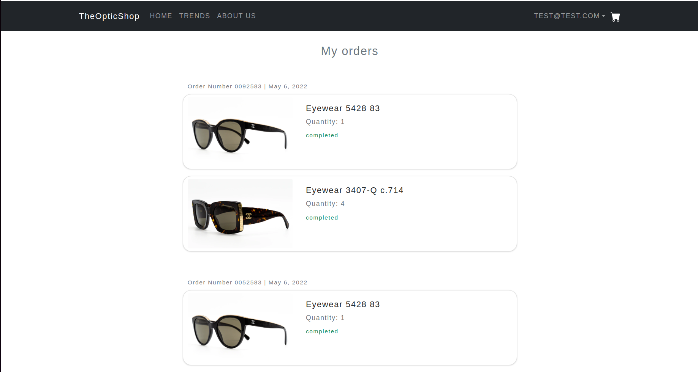

# OPTIC SHOP CLIENT

## Introduction

Optic Shop is an e-commerce app for glasses😎.

## Technologies

1.BackEnd
- Express
- REST
- Sequelize
- Postgres
- NodeJS

2.FrontEnd
- React
- Redux
- Axios
- Bootstrap
- Material UI

## Database Diagram

## Wireframe

## Backend Link : https://github.com/poojadalai/opticshop-server
